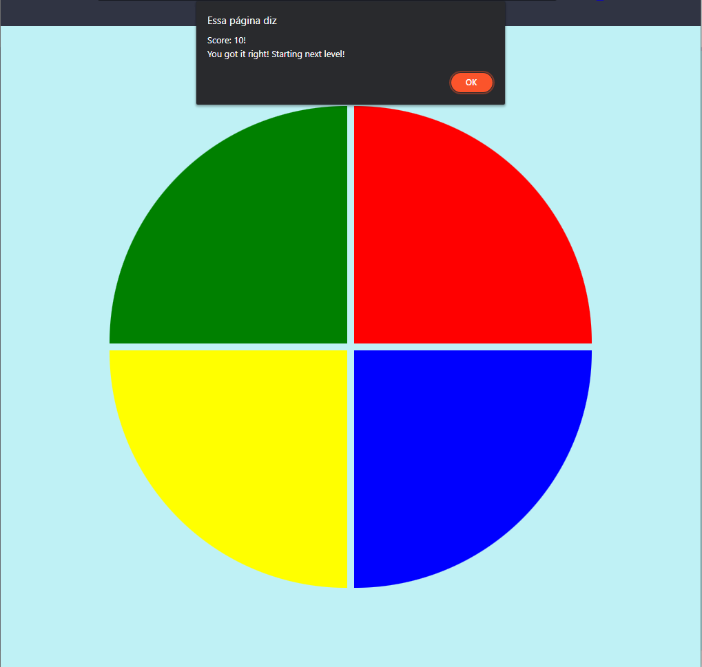

# Genius - DIO challenge

## 💻 Project

In this project, the challenge is to create a Genius game using only HTML, CSS and Javascript in an introductory way, with the main concept being CSS Grid, Array manipulation and Arrow Functions.

## 🚀 Technologies

This project was developed with the following technologies:

- HTML
- CSS
- JavaScript

## 👀 Preview

